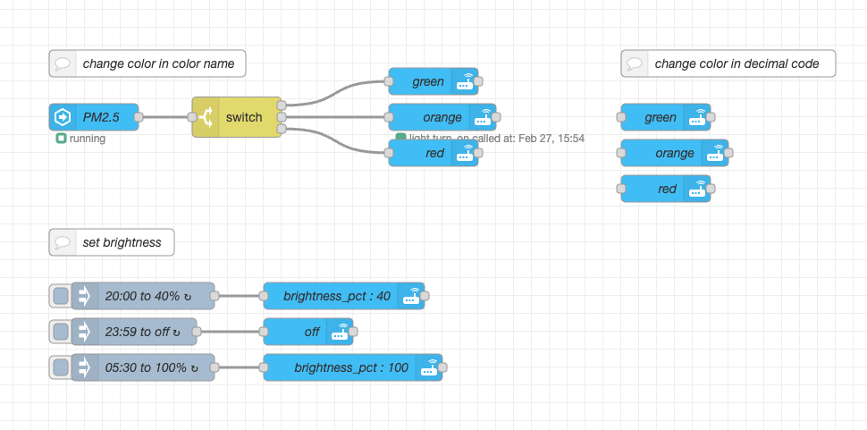

# Home Assistant Weather Station

โปรเจ็คนี้ชื่อว่า RS Weather Station เป็นกล่อง DIY Sensor ที่ประกอบขึ้นโดยใช้กล่องของ Ikea VINDRIKTNING ซึ่งเป็นกล่อง sensor ราคาประหยัดจาก Ikea ที่สวยมากตัวหนึ่งในตลาดและเดิมมีแค่ sensor pm2.5 ซึ่งวัดได้ค่าเดียวและไม่สามารถเชื่อมต่อ Home Assistant ได้ ทางวิศวกรของ RACKSYNC จึงนำมาปรับปรุงเพิ่มชุดอุปกรณ์ที่มีการวัดค่าที่ละเอียดขึ้นและเพิ่ม ESP8266 ให้สามารถทำงานร่วมกับ Home Assistant และน่าใช้มากขึ้น ซึ่งส่วนประกอบที่เพิ่มเข้าไปมีดังต่อไปนี้

| Sensor           | Description      |
|------------------|------------------|
| Wemos D1 (ESP8266)  | Microcontroller
| BME280   | วัดอุณหภูมิ / ความชื้น / ความกดอากาศ        
| RGB LED WS2812   | สำหรับแสดงผลสถานะ        
| PMS7003          | เซ็นเซอร์ PM1/PM2.5/PM10           
| BH1750           | เซ็นเซอร์แสง          
| RESET BUTTON     | ปุ่มรีเซ็ท          

**Tasmota GPIO**

| Setting          | Pin | GPIO       |
|------------------|------|------------|
| ``SCL``              | D4 | GPIO2
| ``SDA``              | D2 | GPIO4
| ``LED``              | D1 | GPIO5
| ``PMS7003 (TX)``     | D5 | GPIO14 
| ``PMS7003 (RX)``     | D6 | GPIO12
| ``BUTTON1``          | D7 | GPIO13 

## วิธีใช้ 

1. ทำการเชื่อมต่อเซ็นเซอร์เข้ากับ WIFI Access Point โดยจ่ายไฟให้กับกล่อง หลังจากนั้นจะเจอ SSID ที่ชื่อว่า "rs-weather-station" ให้เกาะ SSID ดังกล่าว

2. ``Configuration -> Configure Other -> Activate Template``  

3. ``Configuration -> Configure MQTT`` เพื่อเชื่อมต่อไปยัง Home Assistant

4. พิมพ์คำสั่ง ``sensor18 300`` ที่ tasmota console (รอ sensor calibrate ตัวเองประมาณ 5 นาที ค่าฝุ่นก็จะเริ่มโชว์ครับ)  อันนี้เป็นการตั้งค่า polling interval เพื่อไม่ให้ sensor รันในโหมด active ตลอดเวลา เพื่อยืดอายุการใช้งานครับ

5. ตั้งค่า Node-RED เพื่อสร้าง Automation Rules ตามต้องการ

## รีเซ็ท

กรณีต้องการคอนฟิคใหม่ สามารถรีเซ็ท factory ได้สองแบบครับ แบบแรกคือกดผ่านหน้า tasmota ส่วนแบบที่สองคือใช้เข็มจิ้มปุ่มทองเหลืองที่ซ่อนไว้ด้านหลัง 40 วินาที ก็จะกลับมาทำงานในโหมด fallback ap ให้เซ็ท wifi ใหม่อีกครั้งและทำตามข้อ 1-2 อีกรอบครับ

## คำสั่งที่เกี่ยวข้อง

| CMD           | Description      |
|------------------|------------------|
| ``SCL``              | D4 | GPIO2
| ``SDA``              | D2 | GPIO4
| ``LED``              | D1 | GPIO5
| ``PMS7003 (TX)``     | D5 | GPIO14 

## ไฟล์อื่น ๆ 

- [Node-RED Flows](flows.json) Flow การตั้งค่าสีหลอดไฟให้แสดงตามความเข้มของค่าฝุ่น
- [Firmware](bin/rs_weather_station.bin) Firmware พร้อมใช้
- [Firmware Override](user_config_override.h) ไฟล์ tasmota firmware compile override
- [อธิบายการทำงานของ Node-RED](screenshot/node-red.mp4)
- [อธิบายการตั้งค่า](screenshot/wifi-config.mov)

## หากพบปัญหาในการใช้งาน กรุณาส่งเข้า issue

### บริการและเทรนนิ่งคอร์สด้าน Automation 

- [สินค้าและบริการ](http://racksync.com)
- [เทรนนิ่งคอร์ส](https://facebook.com/racksync)

### ชุมชนและแหล่งซื้อขาย Home Automation

- [Home Automation Thailand](https://www.facebook.com/groups/hathailand)
- [Home Automation Marketplace](https://www.facebook.com/groups/hatmarketplace)